# 🤖 AI Role Validator

**XML ↔ PDF Job Role Comparison powered by LangChain, OpenAI, and ChromaDB**
An intelligent validator that compares *structured* XML-defined job roles against *unstructured* PDF documents. It extracts roles from XML, discovers roles inside PDFs via a RAG pipeline, and produces an auditable report highlighting **matched**, **fuzzy-matched**, **incorrect**, and **missing** roles.

---

## 🧩 The Problem

Organizations keep an official **master list of job roles** (e.g., HR database / XML / regulatory submission). In practice, the *same roles* appear inconsistently across vendor resumes, SOWs, audits, and internal PDFs (abbreviations, typos, synonyms, table formats, etc.). Manual validation is slow and error-prone.

### 💡 Real-Time Example

* **Master XML** (ground truth):

  ```xml
  <roles>
    <role>Software Engineer</role>
    <role>Data Scientist</role>
    <role>Quality Assurance Analyst</role>
    <role>Project Manager</role>
  </roles>
  ```
  
* **Incoming PDFs** (unstructured):

  * "Software Eng."
  * "Data Science Specialist"
  * "QA Tester"
  * "Sr. Project Mgr"
  * "UI/UX Designer"

**Questions the reviewer must answer:**

* Is *Software Eng.* equivalent to **Software Engineer**?
* Does *QA Tester* map to **Quality Assurance Analyst**?
* Is *Data Science Specialist* a valid role from the approved list, or a mismatch?

This project **automates** that reasoning using **LLMs + RAG + fuzzy matching**, then emits a **validation report** (and downloadable results) for auditability.

---

## 🌟 Features

* **📄 XML Role Extraction** – Parse XML via XPath to produce the master role list
* **📋 PDF Content Extraction** – Extract text + tables using PyMuPDF
* **🧠 LLM-Powered Role Extraction** – OpenAI GPT models read the PDF content and list roles
* **🔍 RAG Enhancement** – ChromaDB vector store for semantic retrieval from PDF chunks
* **≈ Fuzzy Matching** – Levenshtein & partial ratios to handle typos/abbreviations
* **📊 Validation Report** – Matched / Fuzzy / Incorrect / Missing roles with counts
* **⚙️ Tunable Thresholds** – Configure similarity sensitivity per environment
* **💻 Dual Interface** – CLI runner and Streamlit web UI

---

## 🏗️ Architecture & Diagrams

### 1) System Architecture

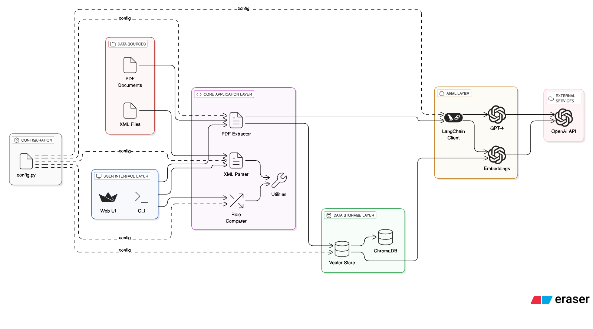

### 2) Data Flow – Complete Pipeline

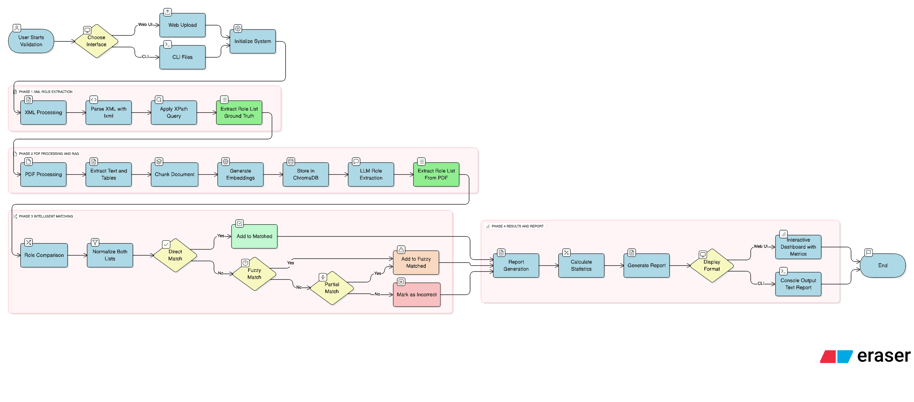

### 3) Performance and Scalability


### 4) RAG Pipeline

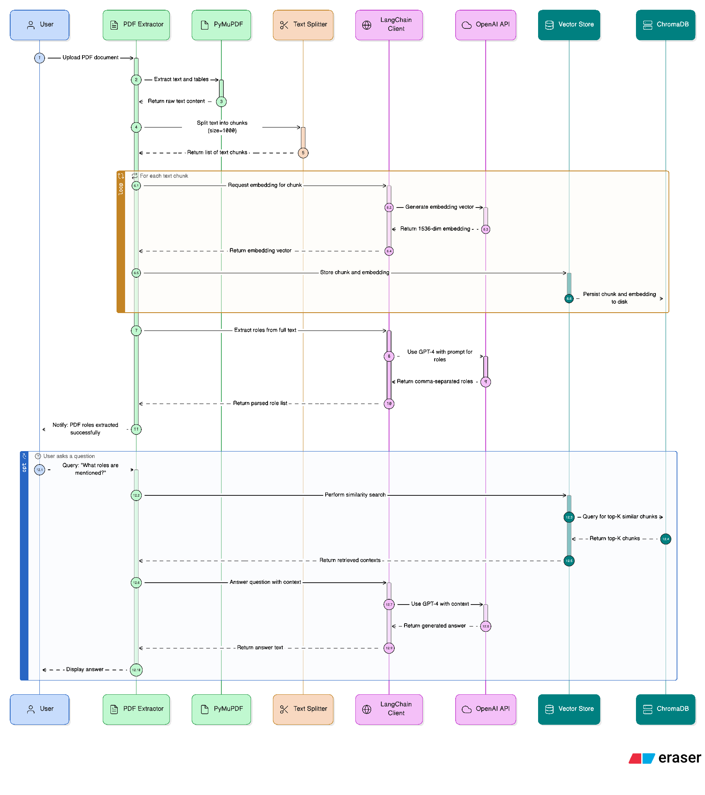

### 5) Role Comparison Logic

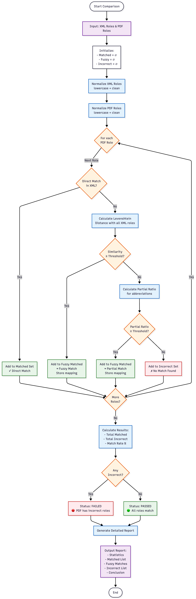

### 6) Component Interaction

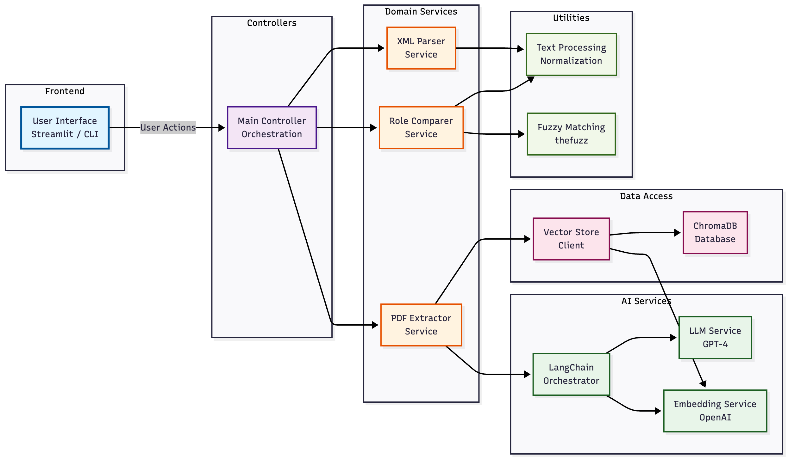

### 7) Technology Stack Visualization

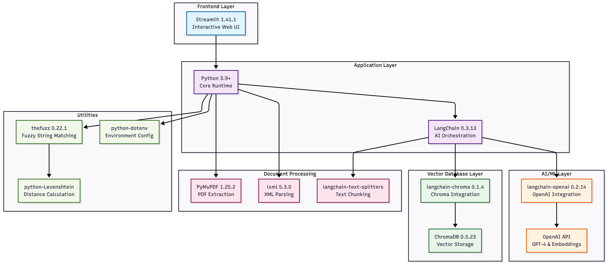

---

## 📸 UI Walkthrough (Screens)

### 1) Home + Configuration


*Set your fuzzy threshold and see the step-by-step guide.*

### 2) Upload XML & PDF

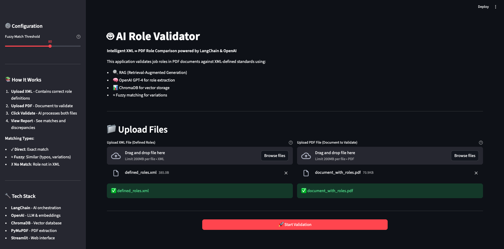

*Attach the master roles XML and the target PDF; click Start Validation.*

### 3) Results — Summary (Matched tab)

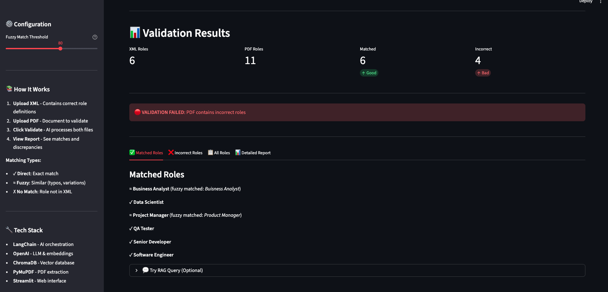
*Dashboard shows XML/PDF role counts, matched total, and high-level status.*

### 4) Results — Incorrect Roles tab

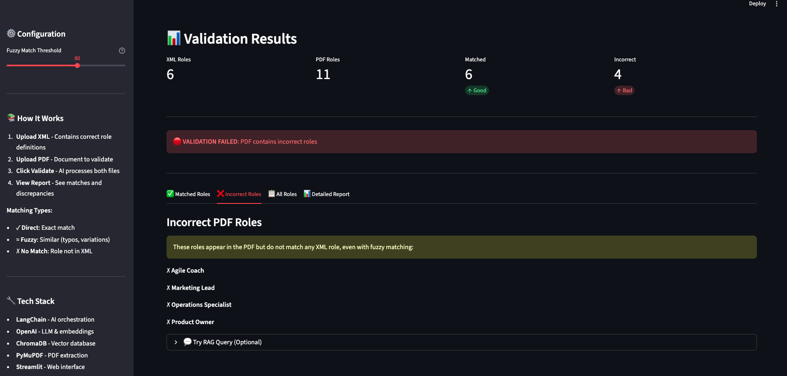
*Roles present in the PDF that don’t map to any XML role (even with fuzziness).*

### 5) Results — All Roles tab

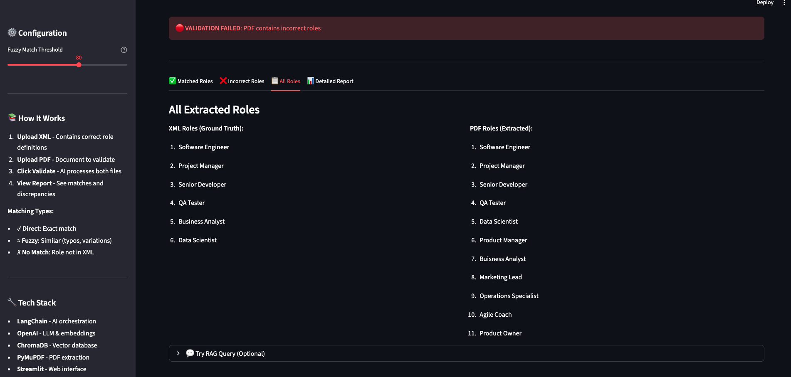
*Compare ground-truth XML roles against extracted PDF roles side-by-side.*

### 6) Detailed Validation Report

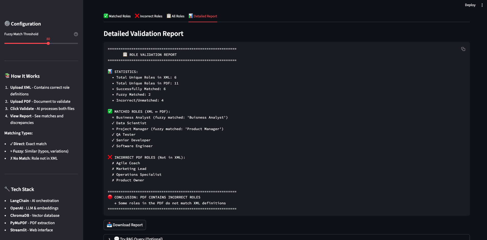
*Auditable, copyable report; includes stats, matched/fuzzy/incorrect, and conclusion. Downloadable.*

### 7) Optional RAG Q&A — List roles

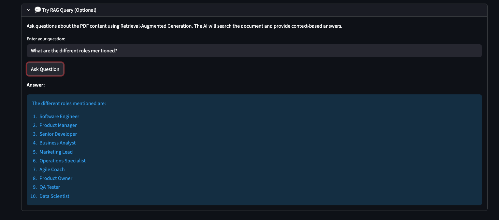
*Ask questions about the PDF; here the model lists all roles mentioned.*

### 8) Optional RAG Q&A — Role counts

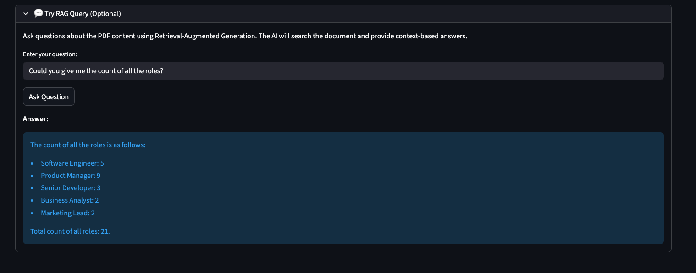
*Get quick analytics, like per-role frequency and total counts.*

### 9) Optional RAG Q&A — New roles in pipeline

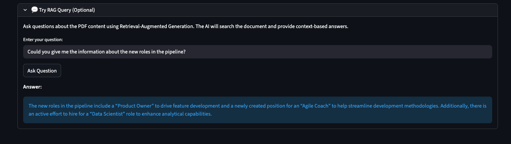
*Extract insights (e.g., new roles referenced) to support downstream decisions.*

---

## 🧠 How It Works

### Phase 1: XML Role Extraction

* Parse XML with `lxml`, extract roles via XPath → **Ground Truth List**

### Phase 2: PDF Processing & RAG

1. Extract text & tables with PyMuPDF
2. Chunk with `RecursiveCharacterTextSplitter`
3. Generate embeddings (OpenAI)
4. Persist to **ChromaDB**
5. (Optional) RAG QA over PDF content

### Phase 3: Role Extraction (LLM)

* Prompt the LLM with full PDF content (and/or retrieved chunks) to produce a **comma-separated role list**

### Phase 4: Intelligent Matching

* **Normalize** both lists (lowercase, punctuation removal)
* **Direct match** → mark as Matched
* Else **Fuzzy match** (Levenshtein / partial ratio) → mark as Fuzzy Matched
* Else → mark as **Incorrect** (in PDF, not in XML)
* Also compute **Missing** (in XML, not found in PDF)

### Phase 5: Validation Report

* Aggregates **Matched / Fuzzy / Incorrect / Missing**
* Provides **counts, percentages**, and **downloadable** outputs

---

## 🌍 Real-World Relevance & Gaps Solved

| Problem in Industry                                                           | How This Solves It                                                    |
| ----------------------------------------------------------------------------- | --------------------------------------------------------------------- |
| Manual validation of job roles across hundreds of vendor/compliance documents | AI automates it, saving hours/days of manual review                   |
| Role name inconsistencies (abbreviations, typos, synonyms)                    | Fuzzy matching + LLM extraction handles variations reliably           |
| PDFs lack structure and uniform format                                        | RAG converts unstructured text into searchable, structured chunks     |
| Regulatory/audit exposure due to mismatched roles                             | Produces an auditable validation report for evidence and traceability |
| HR/Procurement workflows reliant on external PDFs                             | Standardizes roles for integration with internal systems              |

---

## 🏗️ Project Structure

```bash
AI-Role-Validator/
│
├── .env                              # 🔑 Environment variables (API keys, configs)
├── .gitignore                        # 🚫 Files to exclude from git
├── README.md                         # 📘 Project documentation
├── requirements.txt                  # 📦 Python dependencies
├── app.py                            # 💻 Streamlit web UI
│
├── config/
│   └── config.py                     # ⚙️ Configuration management
│
├── data/                             # 📂 Sample data for testing
│   ├── xml_data/
│   │   └── defined_roles.xml         # XML with correct roles
│   └── pdf_data/
│       └── document_with_roles.pdf   # PDF to validate
│
├── src/                              # 🧠 Core application logic
│   ├── langchain_client.py           # 🔮 LLM + embeddings via LangChain
│   ├── vectorstore_client.py         # 🗄️ ChromaDB operations
│   ├── pdf_extractor_rag.py          # 📘 PDF extraction and RAG
│   ├── xml_parser.py                 # 📄 XML parsing with XPath
│   ├── role_comparer.py              # ⚖️ Fuzzy comparison logic
│   ├── utils.py                      # 🔧 Helpers
│   └── main.py                       # 🚀 CLI runner
│
└── chroma_store/                     # 💾 Chroma persistence (auto-created)
    └── role_validator/               # SQLite + embeddings
```

---

## 🚀 Quick Start

### Prerequisites

* **Python 3.9+**
* **OpenAI API Key**
* **UV** (recommended) *or* **pip**

### Install (UV)

```bash
uv venv
source .venv/bin/activate   # Windows: .venv\\Scripts\\activate
uv pip install -r requirements.txt
```

### Install (pip)

```bash
python -m venv venv
source venv/bin/activate     # Windows: venv\\Scripts\\activate
pip install -r requirements.txt
```

### Configure `.env`

```env
OPENAI_API_KEY=sk-your-key
VECTOR_DB=chroma
CHROMA_PERSIST_DIR=./chroma_store
PDF_CHUNK_SIZE=1000
PDF_CHUNK_OVERLAP=100
FUZZY_MATCH_THRESHOLD=80
LLM_MODEL=gpt-4o-mini
EMBEDDING_MODEL=text-embedding-3-small
```

### Run – Streamlit UI

```bash
streamlit run app.py
```

### Run – CLI

```bash
python src/main.py
```

---

## 🔧 Configuration Options

### Fuzzy Matching Threshold

Controls how similar roles need to be for a fuzzy match (0-100):

**90-100**: Very strict (only minor typos)

**80-89**: Moderate (default, handles typos and minor variations)

**70-79**: Lenient (accepts more abbreviations)

**Below 70**: Very lenient (may cause false positives)

---

## 📊 Tech Stack

| Component | Technology | Purpose |
|-----------|-----------|---------|
| **LLM Orchestration** | LangChain | AI workflow management |
| **Language Model** | OpenAI GPT-4 | Role extraction & Q&A |
| **Embeddings** | OpenAI Embeddings | Vector representations |
| **Vector Store** | ChromaDB | Semantic search & retrieval |
| **PDF Processing** | PyMuPDF (fitz) | Text & table extraction |
| **XML Parsing** | lxml | XPath-based extraction |
| **Fuzzy Matching** | thefuzz | String similarity |
| **Web UI** | Streamlit | Interactive interface |

---

## 🧪 Troubleshooting

**No roles from PDF** → Ensure PDF is text-based (not images) or add OCR; try a stronger model (`gpt-4o`).
**Too many fuzzy matches** → Increase `FUZZY_MATCH_THRESHOLD` (e.g., 85–90).
**Chroma errors** → Delete `chroma_store/` and re-run (auto-rebuild).
**API key not found** → Verify `.env` and restart terminal/IDE.

---

## 🤝 Contributing

Contributions are welcome! Please:

1. Fork the repository
2. Create a feature branch (`git checkout -b feature/amazing-feature`)
3. Commit your changes (`git commit -m 'Add amazing feature'`)
4. Push to the branch (`git push origin feature/amazing-feature`)
5. Open a Pull Request

---

## 📄 License

This project is licensed under the MIT License - see the [LICENSE](LICENSE) file for details.

---

## 📧 Contact

For questions or support, please open an issue on GitHub.

---

## 🙏 Acknowledgments

* **LangChain** – Orchestration framework
* **OpenAI** – GPT & embeddings
* **ChromaDB** – Vector storage
* **PyMuPDF** – PDF parsing

---

*Made with ❤️ to remove manual, error-prone validation from HR & compliance workflows.*
